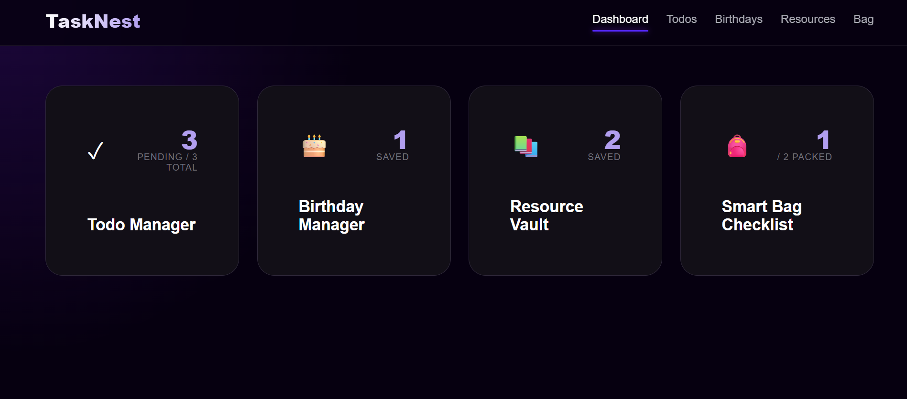
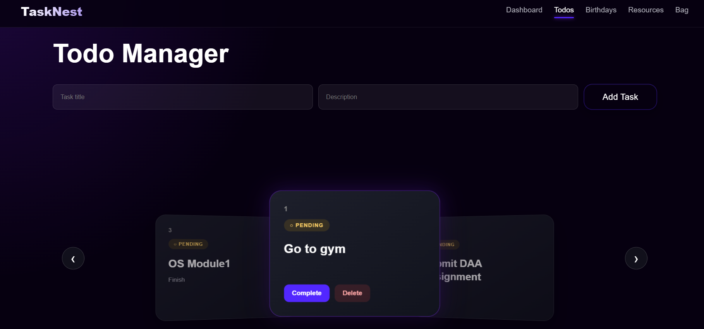
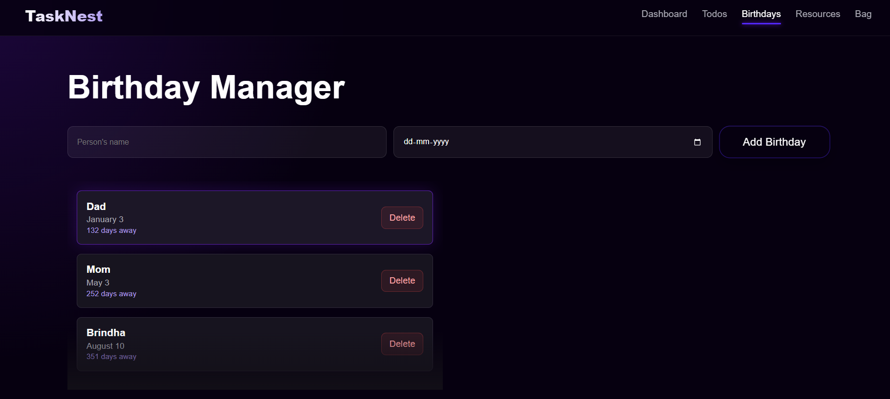
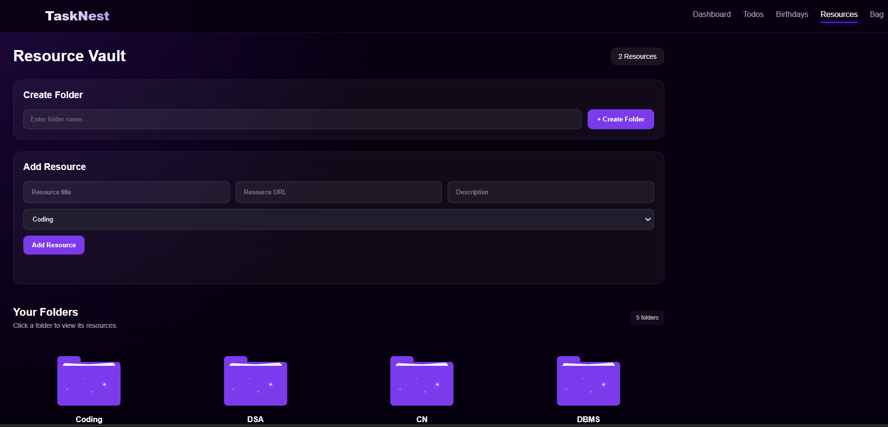
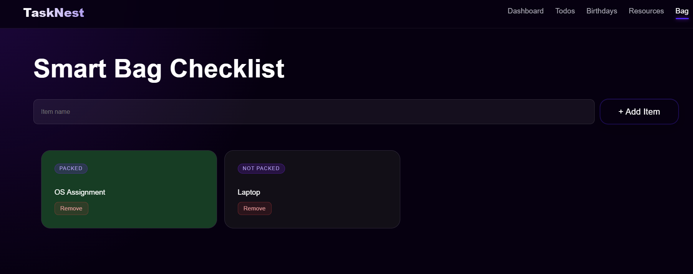

# TaskNest 📚

A full-stack student productivity and resource management application designed to help students organize their daily tasks, birthdays, college resources, and essential items in one place.

## ✨ Features

### 📝 Todo Manager

* Create and manage daily tasks
* Mark tasks as completed
* Delete completed or unnecessary tasks
* View tasks directly from the dashboard

### 🎂 Birthday Manager

* Add and manage birthdays
* Keep track of upcoming birthdays
* View birthday information in an organized interface

### 🎒 Smart Bag Checklist

* Maintain a checklist of essential college items
* Mark items as packed or unpacked
* Helps students prepare their college bag easily

### 📚 Resource Vault

* Organize useful academic resources
* Create folders for different categories
* Store and manage resource links
* Quickly access saved resources

### 📊 Dashboard

The dashboard provides a quick overview of important student activities, including:

* Todo tasks
* Upcoming birthdays
* Saved resources
* Bag checklist status

## 🎨 UI & Design

TaskNest features a modern, interactive and student-friendly interface built with React.

The application includes custom interactive UI components such as:

* Spotlight Cards
* Animated Lists
* Circular Gallery
* Folder UI
* Magic Bento
* Scroll Stack
* Specular Buttons

The design focuses on clean layouts, smooth interactions and an engaging user experience.

## 📸 Screenshots

### Dashboard & Todo Manager

<p align="center">
  
  
</p>

### Birthday Manager & Resource Vault

<p align="center">
  
  
</p>

### Smart Bag Checklist

<p align="center">
  
</p>
## 🛠️ Tech Stack

### Frontend

* React
* Vite
* JavaScript
* CSS
* React Router

### Backend

* Node.js
* Express.js
* REST APIs

### Database

* PostgreSQL

### Tools

* Git
* GitHub
* VS Code

## 📁 Project Structure

```text
TaskNest/
│
├── backend/
│   ├── config/
│   ├── controllers/
│   ├── data/
│   ├── middleware/
│   ├── routes/
│   ├── package.json
│   └── server.js
│
├── frontend/
│   ├── public/
│   ├── src/
│   │   ├── components/
│   │   ├── pages/
│   │   ├── services/
│   │   └── styles/
│   ├── package.json
│   └── vite.config.js
│
├── screenshots/
│   ├── dashboard.png
│   ├── todos.png
│   ├── birthdays.png
│   ├── resources.png
│   └── bag.png
│
├── .gitignore
└── README.md
```

## 🚀 Getting Started

### Prerequisites

Make sure you have the following installed:

* Node.js
* npm
* PostgreSQL
* Git

### 1. Clone the Repository

```bash
git clone https://github.com/madhuree100806/TaskNest.git
cd TaskNest
```

### 2. Install Backend Dependencies

```bash
cd backend
npm install
```

### 3. Configure Environment Variables

Create a `.env` file inside the `backend` folder:

```env
PORT=5000
DB_USER=your_database_user
DB_HOST=localhost
DB_NAME=tasknest
DB_PASSWORD=your_database_password
DB_PORT=5432
```

**Never commit your `.env` file or database credentials to GitHub.**

### 4. Start the Backend

```bash
npm start
```

### 5. Install Frontend Dependencies

Open another terminal:

```bash
cd frontend
npm install
```

### 6. Start the Frontend

```bash
npm run dev
```

Open the local URL provided by Vite in your browser.

## 🔗 API Routes

TaskNest uses REST APIs for communication between the React frontend and Express backend.

```text
/api/todos
/api/birthdays
/api/resources
/api/folders
/api/bag
```

## 🔐 Security

Sensitive configuration files such as `.env` are excluded from the repository using `.gitignore`.

Database credentials should be stored using environment variables rather than directly inside the source code.

## 🎯 Purpose

TaskNest was created as a student-focused productivity application that brings everyday college organization tools into a single workspace.

It combines task management, birthday tracking, academic resources and college bag preparation into one application.

## 🔮 Future Improvements

* Cloud deployment
* User authentication
* Mobile optimization


